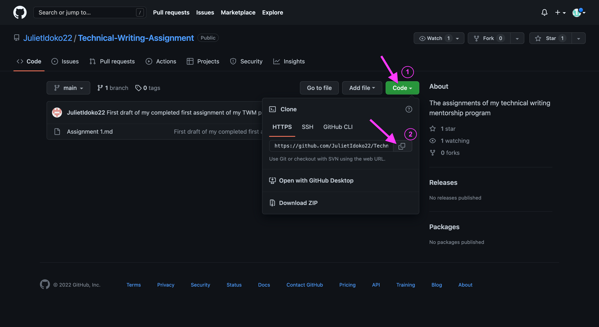

#   Introduction to GitHub

Image of a GitHub got from 
[here](https://madsourcer.com/wp-content/uploads/github.jpg)

# Table of Contents
1. Introduction
2. What is GitHub
3. Why GitHub?
4. Git vs. GitHub
5. Git Commit
6. Git Clone
7. Git Pull 
8. GitHub Desktop vs. GitHub CLI
9. Conclusion

## Introduction
Git is a creation of Linus Torvaldo, the originator of Linus Kernel, in April 2005, to increase the efficiency of the management and tracking of code histories. It makes it possible for a continuous availability of histories of a code and giving room for the comparison of changes made. It has proven to be the most popular **Version Control System** (VCS) as a result of its efficiency and easy accessibility to large number of developers. For Samyak Jain, VCSs are "software tools that assist software teams in managing changes to source code over time."

Git is, however, not the first Version Control System that ever created. There is the **Centralized Version Control** which makes use of a single server or source control considered to be the main repository,. Examples include CVS, SVN, (Subversion) Perfoce, etc. 

Git belongs to the category of the second type of VCS called **Distributed Version Control System.** According to Aditya Sriidhar, this is a system that "has a remote repository which is stored in a server as well as a local repository which is stored in the computer of each developer." It differs from  the Centralized one because the code being worked on is stored in both a server and also available in the local files of all the developers. 

## What is GitHub?

Simply put, GitHub is a hosting platform, in cloud, for git actions. Git repositories are kept open by GitHub for easy accessibility to interested visitors. Launched by Tom Preston-Werner, PJ Hyett and Chris Wanstrath, in 2008, it also helps to connect and gather different changes made on a particular code. 

## Why GitHub?
- GitHub makes it possible for multiple collaboration between developers and social networking of ideas.
- It is considered the storehouse of git repositories.
-  It is an open source that enables the availability of stored files to others.
-  It enables the saving and tracking of changes made during the course of coding.
- Asides being a change tracker house, it is a damage control platform where codes are easily retrieved by a developer who loses the file in his local repository.
-  It can also serve as a marketing house for developers as repositories are there to pitch their owners to potential clients.

## Git vs. GitHub
From the foregoing, one can simply deduce that there is a difference between git and GitHub.

<!-- - A code that is being done by a developer is known to him alone until made accessible to others when sent to the cloud hoster, which is GitHub. -->
<!-- - There is an important knowledge of git before GitHub can be of any use. This means that learning of the git command line is a prerequisite to an acquaintance with the latter. -->

| Git | GitHub|
| -------- | --------|
| Git can is not dependant on GitHub |There is need for an important knowledge of git before GitHub can be of any use. |
| Git is the designer and creator of codes and projects | GitHub is the online hosting service |
|  git is more private and specific to a developer | GitHub is a connecting ground for multiple developers' projects|
|

<!-- 
Image of a git got from [here ](https://www.google.com/imgres?imgurl=https%3A%2F%2Fupload.wikimedia.org%2Fwikipedia%2Fcommons%2Fthumb%2Fe%2Fe0%2FGit-logo.svg%2F1280px-Git-logo.svg.png&imgrefurl=https%3A%2F%2Fcommons.wikimedia.org%2Fwiki%2FFile%3AGit-logo.svg&tbnid=ZddH2hVhNNICvM&vet=12ahUKEwiAt6bBs8v6AhUOTMAKHWagApIQMygCegUIARDhAQ..i&docid=Qzj8717U8pISkM&w=1280&h=535&q=image%20of%20Git&client=ms-android-transsion&ved=2ahUKEwiAt6bBs8v6AhUOTMAKHWagApIQMygCegUIARDhAQ)
 -->

## Clone
Git clone is the act of replicating your remote repository into your local computer in order to easily navigate through both locations. One can either clone his own repository or that of another when he intends making contribution to the developer's ongoing project.  It can either be done by downloading the Zip or downloading it with git using https or CSS.

_**Methods**_

1.  Go to the main page of the intended remote repository and click on clone.
2.   A URL will be shown and you will copy it.
  
 

3. On your VScode project terminal, type the git clone command (git clone) along with the URL copied). Eg. git clone "URL".

###  Syntax

    git clone (url that was copied)
###  Command

    git clone https://github.com/JulietIdoko22/Technical-Writing-Assignment.git

4. Cloning successful !!!, but you still have to link your GitHub repository to your computer with the command below .

###  Syntax

    git remote add origin (url that was copied)
###  Command

    git remote add origin https://github.com/JulietIdoko22/Technical-Writing-Assignment.git

## Git Commit
This is a command used to save projects or new changes made on a code to the repository.

_**How to Commit a File**_

1.  Firstly, add all your changes with this syntax `git add file.txt` or `git add . `
   
   ###  Command

    git add .

2.  Then commit the said file by using the command, `git commit -m "commit message"`

  ###  Command

    git commit -m "this is my first commit message"

## Pull
A Pull request is done in a situation where one who has a Read permission intends to contribute to an ongoing project. This means collaborating with changes made In a repository. It is mostly done by forking a repo especially when you have no access to an open source repo.

**_To Fork a Repo_**
- On the top right corner of a repo, click on the **FORK** button.

Image got from [here](https://www.google.com/imgres?imgurl=https%3A%2F%2Fwww.earthdatascience.org%2Fimages%2Fearth-analytics%2Fgit-version-control%2Fgithubguides-bootcamp-fork.png&imgrefurl=https%3A%2F%2Fwww.earthdatascience.org%2Fworkshops%2Fintro-version-control-git%2Fabout-forks%2F&tbnid=6bgdQCkyCIPUSM&vet=12ahUKEwjE7qbpp8v6AhWViFwKHUcHDcEQMygLegUIARDYAQ..i&docid=myvoOLO3i-pKTM&w=738&h=148&q=how%20tto%20do%20fork%20on%20github&client=ms-android-transsion&ved=2ahUKEwjE7qbpp8v6AhWViFwKHUcHDcEQMygLegUIARDYAQ)

- A new copy which includes all the copies, branches and commits made on that repo will automatically appear under your own account with a new URL.
- Finally, the clone is done by using the clone command, git clone "repo URL" on your local terminal.
- Create a new branch using the command, git checkout -b "branch name."
- Also generate a new remote repository for the original repo you forked using the command, git remote add upst
- After making the changes, adding the changes to the branch and commiting it, you also need to create a pull request which will notify the owner of the repository whether to merge your changes or not.

Image got from [here](https://www.google.com/imgres?imgurl=https%3A%2F%2Fopensource.com%2Fsites%2Fdefault%2Ffiles%2Fuploads%2Fopen-a-pull-request_crop.png&imgrefurl=https%3A%2F%2Fopensource.com%2Farticle%2F19%2F7%2Fcreate-pull-request-github&tbnid=t_p5l3lv2j9sPM&vet=12ahUKEwjVmIu1psv6AhUQiFwKHY78A7YQMygAegUIARDCAQ..i&docid=KNlJ5o_Hzs8hNM&w=650&h=540&q=how%20tto%20do%20a%20Pull%20request%20on%20git&client=ms-android-transsion&ved=2ahUKEwjVmIu1psv6AhUQiFwKHY78A7YQMygAegUIARDCAQ)
## GitHub Desktop vs. GitHub CLI
**GitHub Desktop** means interacting in GitHub using a GUI. This application can aid you to perform most git commands, like pull, push, commit, clone, etc., right from your desktop. Hardly any difference exists between this application and that of the website.

Image got from [here ](https://www.google.com/imgres?imgurl=https%3A%2F%2Fcarldesouza.com%2Fwp-content%2Fuploads%2F2020%2F03%2Fimg_5e72a64e32003.png&imgrefurl=https%3A%2F%2Fcarldesouza.com%2Finstalling-and-using-github-desktop-on-windows%2F&tbnid=6hs9h7t1YowPZM&vet=12ahUKEwjTidedssv6AhVYTUEAHZXSCWcQMygDegUIARDjAQ..i&docid=dv9_cJA3RQvdsM&w=1054&h=657&q=github%20desktop&client=ms-android-transsion&ved=2ahUKEwjTidedssv6AhVYTUEAHZXSCWcQMygDegUIARDjAQ)

However, **GitHub CLI** (Command Line Interface) is a command line specialized tools that help you perform GitHub functions like pulling, pushing, adding, commiting, etc., from your local terminal. They are inbuilt with special syntaxes that guide the smooth navigation and performance of git functions. 

Image got from [here](https://www.google.com/imgres?imgurl=https%3A%2F%2Fwww.techiedelight.com%2Fwp-content%2Fuploads%2Fgit-clone-directory.png&imgrefurl=https%3A%2F%2Fwww.techiedelight.com%2Fclone-a-git-repository-into-specific-folder%2F&tbnid=nXB-E2uIe1zytM&vet=12ahUKEwixm5rnkc36AhWggs4BHajiAzYQMygcegUIARCHAg..i&docid=pwdzrC8K5kwc7M&w=612&h=270&q=image%20of%20a.github%20CLI&client=ms-android-transsion&ved=2ahUKEwixm5rnkc36AhWggs4BHajiAzYQMygcegUIARCHAg)

There is a great similarity and little divergence extant between Windows Command Line with GitHub Command Line. 

## Conclusion
A basic knowledge of git and GitHub marks a great beginning to the journey of a programmer. Also, a mastery of the connectivity between the two and their syntax aids your smooth glide to the art of coding. However, other forms of writing like blog posts, literary writings, journal articles, digital marketing, etc, can be included among the benefits ascribed to the two modern technology creations.
