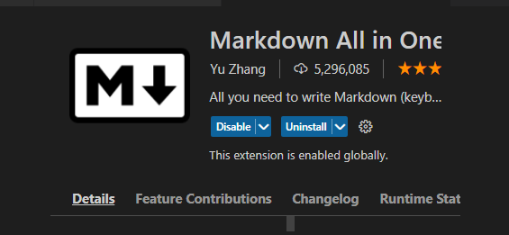
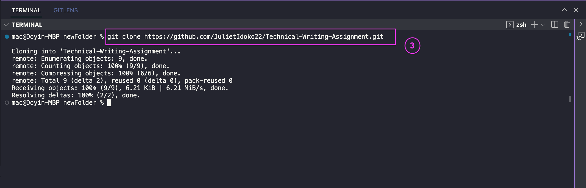
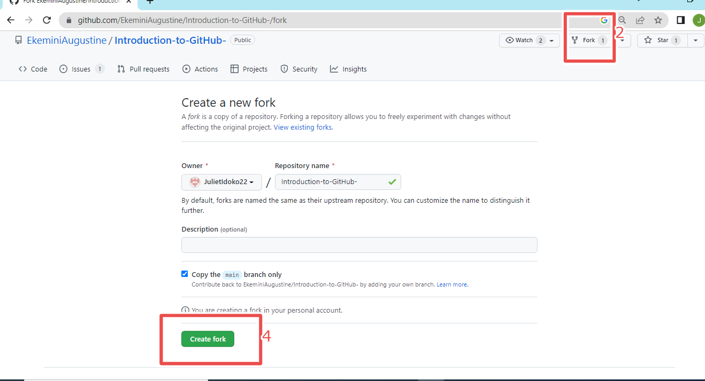

}#   Introduction to GitHub

# Table of Contents
1. Introduction
2. What is GitHub
3. Why GitHub?
4. Git vs. GitHub
5. Git Commit
6. Git Clone
7. Git Pull 
8. GitHub Desktop vs. GitHub CLI
9. Conclusion

## Introduction
Greater output and excellent results are more guaranteed theough collaboration and team playing. Both social media content creators, app developers, web developers,app managers have a need of affiliating and working with others to share ideas so as to give room for more succeeful outputs. Git and GitHub are such avenue that make this possible. Git is a **Version Control System** (VCS) that helps to manage and track code histories through a continuous availability of the creation process of a code and giving room for the comparison of changes made. GitHub is, then, a medium where different works and projects are deposited for access by visitors.

Git belongs to the category of the second type of VCS called **Distributed Version Control System** which is different fron the first one called **Centralized Version Control.** It differs from  the Centralized one because the code being worked on is stored in both a server and also available in the local files of all the developers. 

However, in this article, focus is more on GitHub than git. Nevertheless, we will look at the differences between git and GitHub, different syntaxes and commands used in git, for instance, git pull, git clone, gitm commit, etc.

## What is GitHub

GitHub is a hosting platform, in cloud, for git actions. It is specifically this resource that enaables collaboration on projects by multiple deveopers. Git repositories are kept open by GitHub for easy accessibility to interested visitors. Launched by Tom Preston-Werner, PJ Hyett and Chris Wanstrath, in 2008, it also helps to connect and gather different changes made on a particular code or project. 

## Why GitHub?
- GitHub makes it possible for multiple collaboration between developers and social networking of ideas.
- It is considered the storehouse of git repositories.
-  It is an open source that enables the availability of stored files to others.
-  It enables the saving and tracking of changes made during the course of coding.
- Asides from being a change tracker house, it is a damage control platform where codes are easily retrieved by a developer who loses the file in his local repository.
-  It can also serve as a marketing house for developers as repositories are there to pitch their owners to potential clients.

## Git vs. GitHub
From the foregoing, one can simply deduce that there are differences between git and GitHub.

| Git | GitHub|
| -------- | --------|
| Git is not dependant on GitHub |There is need for an important knowledge of git before GitHub can be of any use. |
| Git is the designer and creator of codes and projects | GitHub is the online hosting service |
|  git is more private and specific to a developer | GitHub is a connecting ground for multiple developers' projects|
| Git is restrictive of collaborations | Acode that is been built by a developer is known to him alone until made accessible in the cloud hoster which is GitHub |

We have finished with the theoretical aspect of this lesson. Now, we are going into the technical part. But before then, you need to get yourself ready by getting these resources:

[Register for a GitHub accunt](GitHub.com)

[Visual Studio Code](https://code.visualstudio.com/download) or VSCODE for short.

[Git](https://github.com/git-for-windows/git/releases/download/v2.38.1.windows.1/Git-2.38.1-64-bit.exe) for windows

Inside the VSCODE, navivgate to the last icon at the drop down menu by your left. There, you can get the [Msrkdown All in One Extension](https://marketplace.visualstudio.com/items?itemName=yzhang.markdown-all-in-one) or just type "Markdown All in One Extension" in the search bar and then choose the very first option that pops up.

Now, you are the practical aspect of this lesson.

These directions shown here mean that they are the resources to be used for the purpose of this article. You are free to explore other text editors too.

## Clone
Git clone is the act of replicating your remote repository into your local computer in order to easily navigate through both locations. One can either clone his own repository or that of another when he intends making contributions to the developer's ongoing project.  It can either be done by downloading the Zip or downloading it with git using https or SSH.

_**Methods**_

1. Open your GitHub account and navigate to your repositiry of interest
2. At the left corner is a menu with a "Code" written with a green colour. Click on it

   
3. A menu will show with options of HTTPS or SSH and bearing different URL (for the sake of this lesson, we will be making use of the "HTTPS" URL)

4. Click on the copy icon attached to the HTTPS URL to copy the code.

5.  Open your VS code and navigate to the file menu to create a folder.
6.  Select that folder, come back to your VS code and create a file
7.  Then click on "view" and select "Terminal" from the drop down menu
8.  At the down left corner of your interface, click on the "minus" icon
9.  Select git Bash from the drop down menu that will show.

10. Then, inside the git terminal that will show, type the git clone command (git clone) along with the URL copied).  

###  Syntax

    git clone (url that was copied)
###  Command

    git clone https://github.com/JulietIdoko22/Technical-Writing-Assignment.git

 *Cloning successful* !!!. However, you still have to link your GitHub repository to your computer with the command below .

###  Syntax

    git remote add origin (url that was copied)
###  Command

    git remote add origin https://github.com/JulietIdoko22/Technical-Writing-Assignment.git

    Now you can access your repo locally on you Pc via VS cose

## Git Commit
This is a command used to save projects or new changes made on a code to the repository.

_**How to Commit a File**_

1. 
2. 

3.  Firstly, add all your changes with this syntax `git add file.txt` or `git add . `
   
   ###  Command

    git add .

4.  Then commit the said file by using the command, `git commit -m "commit message"`

  ###  Command

    git commit -m "this is my first commit message"

## Git Pull
A Pull request is done in a situation where one who has a "Read me" permission intends to contribute to an ongoing project. This means collaborating with changes made in another's repository. It is mostly done by forking a repo especially when you have no access to an open source repo. But in a situation where you have an access to the Repository, you can easily send a Pull Request.

**_To Fork a Repo_**
1. Open the repo that you want to effect your change on.
2. On the top right corner of the repo, click on the **FORK** button.
3. A new copy which includes all the copies, branches and commits made on that repo will automatically appear under your own account with a new name and a new URL. You can choose to change the name of your own copy of the repo or opt to leave it exactly as it is.
4. Click on the create fork button.

5. Finally, the clone is done by using the clone command, git clone "repo URL" on your local terminal, which, in this tutorial, is your VS code terminal.
6. Create a new branch using the command, git checkout -b "branch name."
7. Also generate a new remote repository for the original repo you forked using the command, git remote add upst.
8. After making the changes, adding the changes to the branch and commiting it, you also need to create a pull request which will notify the owner of the repository whether to merge your changes or not.
  
  ## GitHub Desktop vs. GitHub CLI
**GitHub Desktop** means interacting in GitHub using a GUI. This application can aid you to perform most git commands, like pull, push, commit, clone, etc., right from your desktop. Hardly any difference exists between this application and that of the website.

Image got from [here ](https://www.google.com/imgres?imgurl=https%3A%2F%2Fcarldesouza.com%2Fwp-content%2Fuploads%2F2020%2F03%2Fimg_5e72a64e32003.png&imgrefurl=https%3A%2F%2Fcarldesouza.com%2Finstalling-and-using-github-desktop-on-windows%2F&tbnid=6hs9h7t1YowPZM&vet=12ahUKEwjTidedssv6AhVYTUEAHZXSCWcQMygDegUIARDjAQ..i&docid=dv9_cJA3RQvdsM&w=1054&h=657&q=github%20desktop&client=ms-android-transsion&ved=2ahUKEwjTidedssv6AhVYTUEAHZXSCWcQMygDegUIARDjAQ)

However, **GitHub CLI** (Command Line Interface) is a command line specialized tools that help you perform GitHub functions like pulling, pushing, adding, commiting, etc., from your local terminal. They are inbuilt with special syntaxes that guide the smooth navigation and performance of git functions. 

Image got from [here](https://www.google.com/imgres?imgurl=https%3A%2F%2Fwww.techiedelight.com%2Fwp-content%2Fuploads%2Fgit-clone-directory.png&imgrefurl=https%3A%2F%2Fwww.techiedelight.com%2Fclone-a-git-repository-into-specific-folder%2F&tbnid=nXB-E2uIe1zytM&vet=12ahUKEwixm5rnkc36AhWggs4BHajiAzYQMygcegUIARCHAg..i&docid=pwdzrC8K5kwc7M&w=612&h=270&q=image%20of%20a.github%20CLI&client=ms-android-transsion&ved=2ahUKEwixm5rnkc36AhWggs4BHajiAzYQMygcegUIARCHAg)

There is a great similarity and little divergence extant between Windows Command Line with GitHub Command Line. 

## Conclusion
A basic knowledge of git and GitHub marks a great beginning to the journey of a programmer. Also, a mastery of the connectivity between the two and their syntax aids your smooth glide to the art of coding. However, other forms of writing like blog posts, literary writings, journal articles, digital marketing, etc, can be included among the benefits ascribed to the two modern technology creations. 

