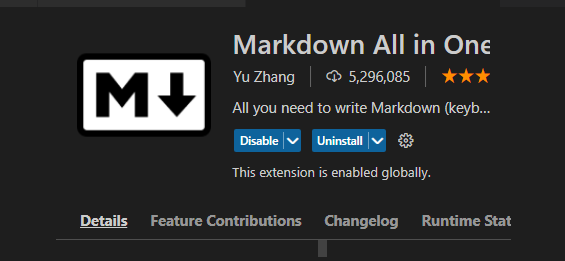

Introduction to GitHub

# Table of Contents
1. Introduction
2. What is GitHub
3. Why GitHub?
4. Git vs. GitHub
5. Git Clone
6. Git Commit
7. Git Pull 
8. GitHub Desktop vs. GitHub CLI
9. Conclusion

## Introduction
Greater output and excellent results are more guaranteed through collaboration and team playing. Both social media ccontent creators, app developers, web developers, app managers have a need of affiliating and working with others to share ideas so as to give room for more succeeful outputs. Git and GitHub are such avenue that make this possible. Git is a **Version Control System** (VCS) that helps to manage and track code histories through a continuous availability of the creation process of a code and giving room for the comparison of changes made. GitHub is, then, a medium where different works and projects are deposited for access by visitors.

Git belongs to the category of the second type of VCS called **Distributed Version Control System** which is different fron the first one called **Centralized Version Control.** Distributed Version Control differs from  the Centralized one because the code being worked on is stored in both a server and also available in the local files of all the developers. 

However, in this article, focus is more on GitHub than git. Nevertheless, we will look at the differences between git and GitHub, as well as the different syntaxes and commands used in git, for instance, git pull, git clone, git commit, etc.

## What is GitHub

GitHub is a hosting platform, in cloud, for git actions. It is specifically this resource that enaables collaboration on projects by multiple deveopers. Git repositories are kept open by GitHub for easy accessibility to interested visitors. Launched by Tom Preston-Werner, PJ Hyett and Chris Wanstrath, in 2008, it also helps to connect and gather different changes made on a particular code or project. 

## Why GitHub?
- GitHub makes it possible for multiple collaborations between developers and social networking of ideas.
- It is considered the storehouse of git repositories.
-  It is an open source that enables the availability of stored files to others.
-  It enables the saving and tracking of changes made during the course of coding.
- Asides from being a change tracker house, it is a damage control platform where codes are easily retrieved by a developer who loses the file in his local repository.
-  It can also serve as a marketting house for developers as repositories are there to pitch their owners to potential clients.

## Git vs. GitHub
From the foregoing, one can simply deduce that there are differences between git and GitHub.

 |Git | GitHub| 
| -------- | --------|
Git is not dependant on GitHub |There is need for an important knowledge of git before GitHub can be of any use. |
| Git is the designer and creator of codes and projects | GitHub is the online hosting service |
|  git is more private and specific to a developer | GitHub is a connecting ground for multiple developers' projects|
| Git is restrictive of collaborations | A code that is been built by a developer is known to him alone until made accessible in the cloud hoster which is GitHub |

We have finished with the theoretical aspect of this lesson. Now, we are going into the technical part. But before then, you need to get yourself ready by getting these resources:

1. [Register a GitHub account](GitHub.com)

2. [Visual Studio Code](https://code.visualstudio.com/download) or VSCODE for short.

3. [Git](https://github.com/git-for-windows/git/releases/download/v2.38.1.windows.1/Git-2.38.1-64-bit.exe).

Inside the VSCODE, navivgate to the last icon at the drop down menu by your left. There, you can get the [Msrkdown All in One Extension](https://marketplace.visualstudio.com/items?itemName=yzhang.markdown-all-in-one) or just type "Markdown All in One Extension" in the search bar and then choose the very first option that pops up.

Now, you are ready for the practical aspect of this lesson.

These directions shown here mean that they are the resources to be used for the purpose of this article. You are free to explore other text editors too.

## Git Clone
Git clone is the act of replicating your remote repository into your local computer in order to easily navigate through both locations. One can clone his own repository when he changes his original working desktop. One can also clone the repository of another when he intends making contributions to the developer's ongoing project.  It can either be done by downloading the Zip or downloading it with git using https or SSH.

_**Methods**_

1. Open your GitHub account and navigate to your repository of interest.
2. At the left corner is a menu with a "Code" written with a green colour. Click on it.
 
3. A menu will show with options of HTTPS or SSH and bearing different URL (for the sake of this lesson, we will be making use of the "HTTPS" URL)

4. Click on the copy icon attached to the HTTPS URL to copy the code.

5.  Open your VS code and navigate to the file menu to create a folder.
6.  Select that folder, come back to your VS code and create a file.
7.  Then click on "view" located at the topmost part of your interphase, and select "Terminal" from the drop down menu.
8.  At the down left corner of your interface, click on the "scroll down" icon after the "plus" icon.
9.  Select git Bash from the drop down menu that will show.
10. Then, inside the git terminal that will show, type the git clone command (git clone) along with the URL copied).  

###  Syntax

    git clone (url that was copied)
###  Command

    git clone https://github.com/JulietIdoko22/Technical-Writing-Assignment.git

 *Cloning successful* !!!. However, you still have to link your GitHub repository to your computer with the command below .

###  Syntax

    git remote add origin (url that was copied)
###  Command

    git remote add origin https://github.com/JulietIdoko22/Technical-Writing-Assignment.git

   
 Now you can access your repo locally on you Pc via VS code

## Git Commit
This is a command used to save projects or new changes made on a code to the repository. Before you commit your changes, make sure that you have made the necessary changes on that file. If you are through with your changes, let's get down to committing your changes.

_**How to Commit a File using GitHub CLI**_
1. Open your VScode
2. Open the folder where you saved your repository in your local machine. 
3. At this stage, go through your file and proofread to make sure that all necessary changes and corrections have been made
4. click on CTRL+S to save your changes
5. Navigate to the top left corner of the VScode and click on 'view.'
6. Just like you did when you were cloning your repository, click on terminal from the drop down menu.
7. Then navigate to the down left corner of your opened repository and click on the sign after the plus sign there.
8. Select git Bash which will open a git Terminal at the down-part side of your interface. That is where you will perform your commit commands.
9. Open your repositoery using this 
    
    ### Syntax 
        'cd name of repository'
    

 ### Command

    cd Technical-Writing-Assignment

10. To check the status of your repository, use this:
 ### Syntax
        'git status'
    
### Command
        git status

The changes that are ready to be committed will be written in red colour.

11.   Then add all your changes with this:
   ### Syntax
     "git add file.txt" or "git add ." 
   
   ###  Command

    git add .
This will bring the file up for staging.
1.  You can still choose to check the status of your staged changes by typing, git status as you did before. In this case, all the changes made will be in green colour showing that they are ready to be committed.
2.  Then commit the said file by using this: 
   ### Syntax
    `git commit -m "any commit message"`
     
  ###  Command

    git commit -m "these changes"
    

This is my first commit message

## Git Pull
A Pull request is done in a situation where one who has a write permission intends to contribute to an ongoing project. This means collaborating with changes made in another's repository. It is mostly done by forking a repo especially when you have no access or write permission to effect changes directly to an open source repo. But in a situation where you have a write permission to the Repository, you can easily send a Pull Request. 

This article will walk you through on how to fork a repository in order to effect changes before sending a Pull Request.

**_To Fork a Repo_**
1. Open the repo that you want to effect your change on.
2. On the top right corner of the repo, click on the **FORK** button.
3. A new copy which includes all the copies, branches and commits made on that repo will automatically appear under your own account with a new name and a new URL. You can choose to change the name of your own copy of the repo or opt to leave it exactly as it is.
4. Click on the create fork button.

5. Finally, the clone is done by using the clone command, git clone "repo URL" on your local terminal, which, in this tutorial, is your VS code terminal.
6. Create a new branch using this syntax and command:
   ### Syntax

     git checkout -b "branch name."

   ### Command

       git checkout -b "Fix Index.md"

   
7. Also generate a new remote repository for the original repo you forked using the command, git remote add upst.
8.  After making the changes, adding the changes to the branch and commiting it, you also need to create a pull request which will notify the owner of the repository whether to merge your changes or not.
9. Then, you wait patiently for the owner of the repository to accept your Pull Request.
  
  ## GitHub Desktop vs. GitHub CLI

|GitHub Desktop | GitHub CLI|
| -------------- | ---------- |
|interacting in GitHub using a GUI | This is making use of GitHub through the website |
|This is readily avaialble on your desktop for you to log into your account| You have to log into the GitHub website through a browser before you can use the commands|
|git commands have already been inbuilt into the software for you to easily navigate your way around it| You can link your editor and your git username for you to be able to push your commits to myour GitHub account.

## Conclusion
A basic knowledge of git and GitHub marks a great beginning to the journey of a programmer. Also, a mastery of the connectivity between the two and their syntax aids your smooth glide to the art of coding. I hope that this article was really helpful in walking you through the basic knowledge of the use of git and GitHub such as how to clone a repositiry, how to commit changes to a repository and how to make a Pull Request by forking the repository.

**Visit here for More Information on:**

[Basic git commands](https://git-scm.com/docs/gittutorial)

[Markdown guide and syntax](https://www.markdownguide.org/basic-syhntax/)
